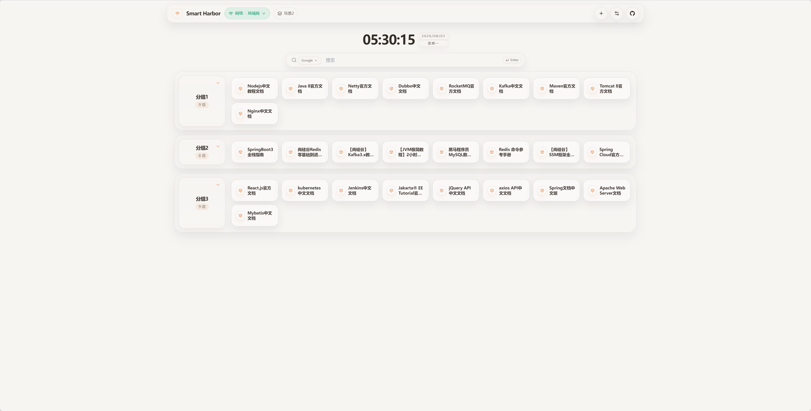
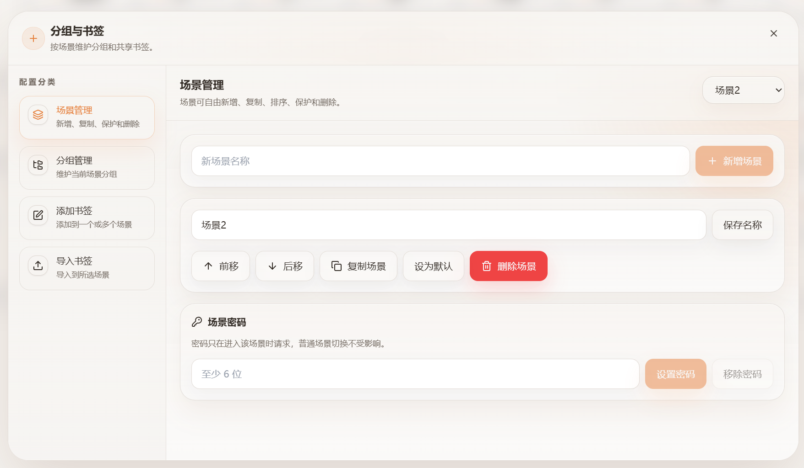
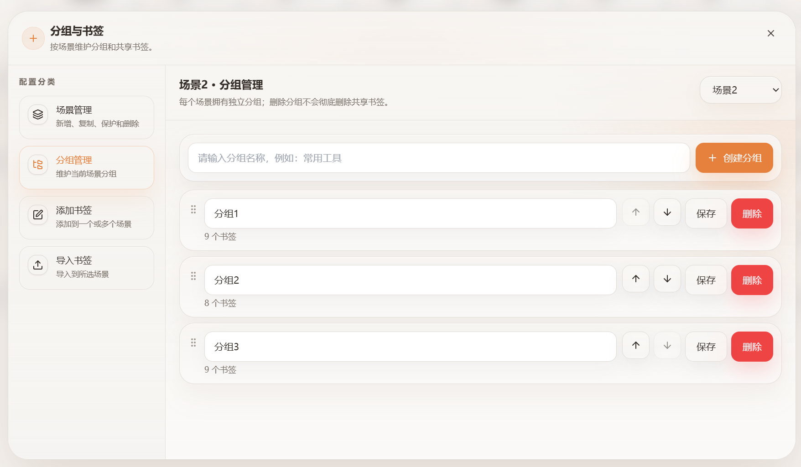
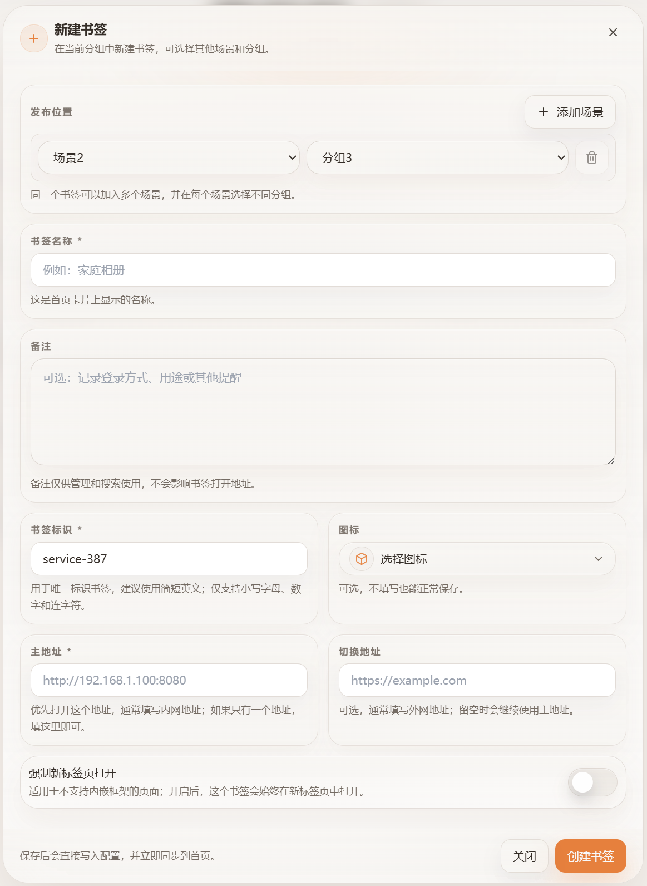
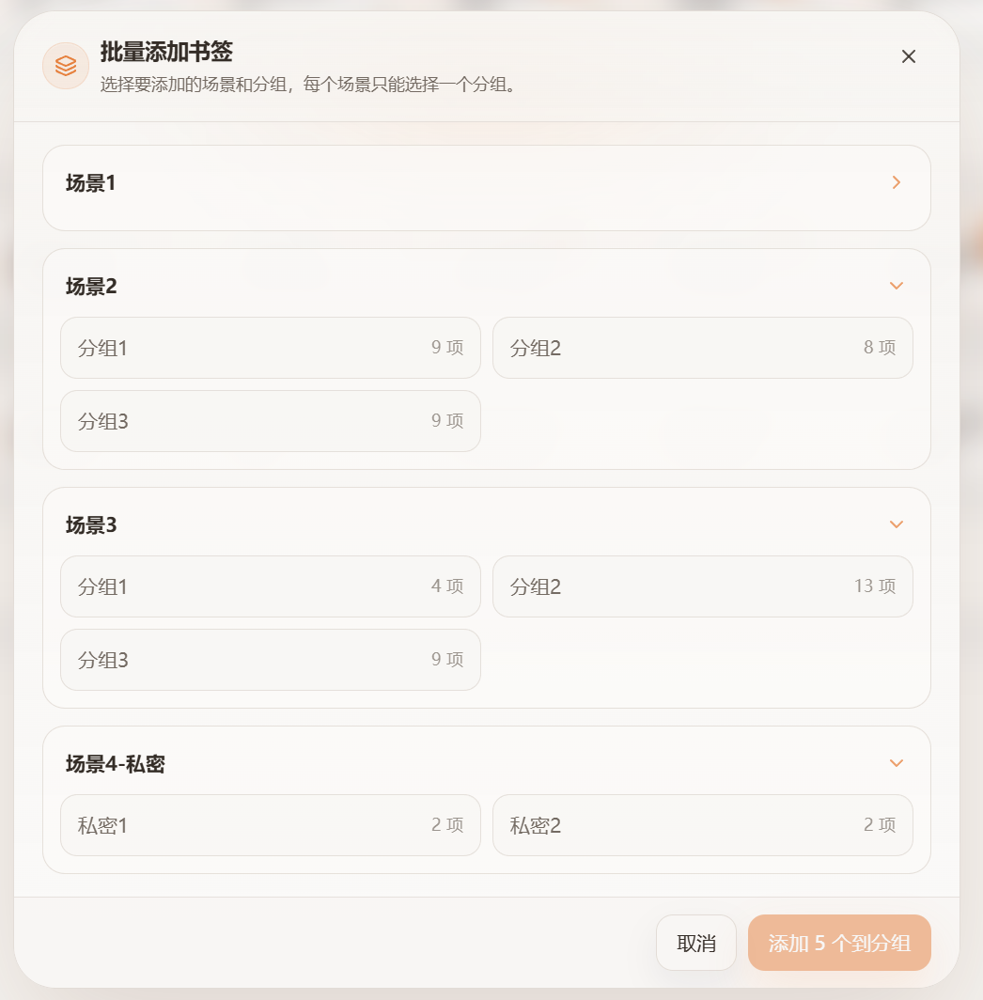
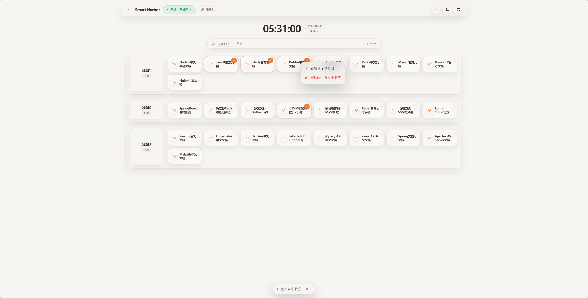
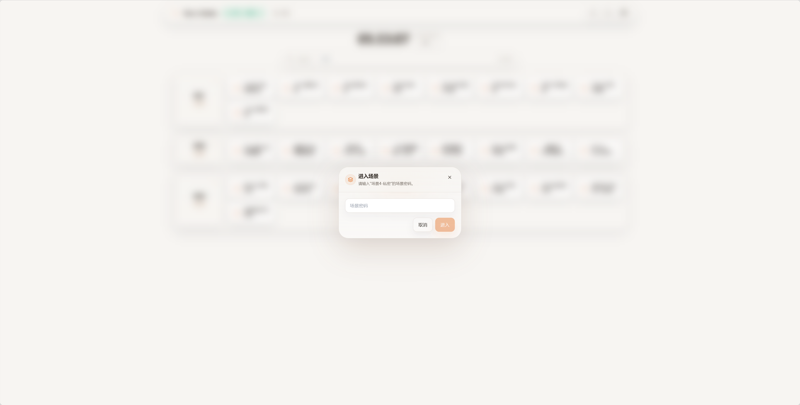
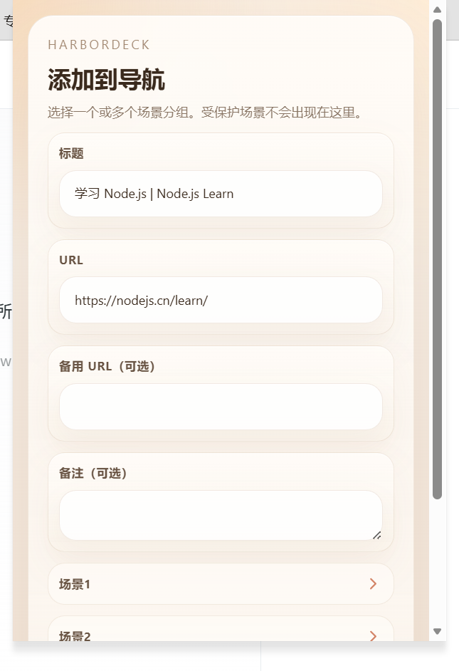
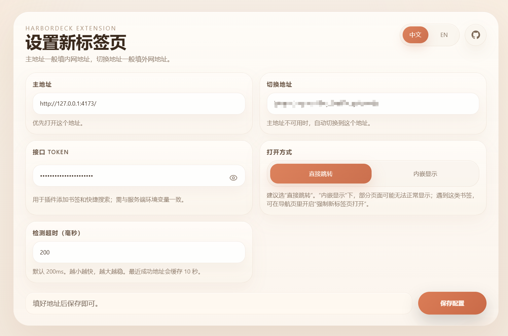
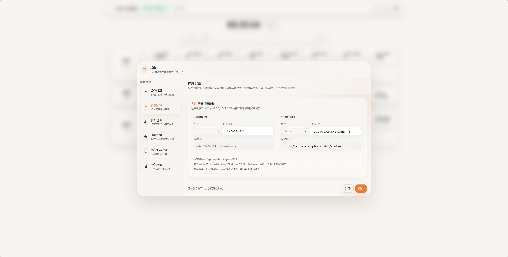

# HarborDeck

[English](README.md)

HarborDeck 是一个面向个人自托管服务的导航首页，适合把“家里、公司、隐私”几套书签放在同一个系统里管理。它把场景、分组、共享书签、内外网地址判断和浏览器新标签页扩展整合在一个 Docker 服务中。

项目按单管理员设计，不提供游客模式。管理员登录后可以创建任意数量的场景；如果某个场景不希望被别人看到，还可以给它单独设置场景密码。

## 致谢

本项目是在 [Goalonez/smart-harbor](https://github.com/Goalonez/smart-harbor) 的基础上持续优化而来。感谢原作者开源了这个项目，为 HarborDeck 提供了很好的起点；本仓库在此基础上继续完善场景、书签管理、浏览器扩展和部署体验。

## 主要能力

- 场景完全由后台创建、重命名、排序、设为默认、加密和删除，不写死为三个场景。
- 每个场景拥有独立的分组和顺序；同一个书签可以被多个场景引用，并在不同场景归属于不同分组。
- 每个书签支持主地址和可选备用地址，系统按照网络可达性选择实际打开的地址。
- 浏览器导入时先选择目标场景；多层文件夹会按完整路径折叠成可读的一级分组，不会把所有书签无序铺平。
- 支持新增、编辑、复制、拖动、多选、批量移动和删除书签。删除某个场景中的引用不会影响其他场景；只有完全没有场景引用的孤立书签才会被清理。
- 每个书签有可选的多行备注栏。
- 搜索框支持 Google 和自定义搜索引擎。无论本地是否匹配到书签，按 Enter 都会执行搜索；也可以直接点击匹配到的书签。
- 场景可以单独设置密码，解锁状态只保留在当前浏览器会话中。
- 提供带 Token 的搜索接口，方便接入 uTools 等快捷工具；有密码的场景永远不会被接口返回。
- 可选的 Chrome/Chromium 扩展：新标签页打开导航首页，并把当前网页添加到一个或多个场景分组。
- 支持通过 WebDAV 备份、恢复和保留多个配置版本。

## 界面预览

以下截图来自当前 HarborDeck Web 界面和浏览器扩展。





















## Docker 部署

项目提供通用 Docker Compose 配置，可用于 Docker Compose、群晖 Container Manager 或其他兼容环境。镜像从 GitHub Container Registry 拉取已经构建好的多架构版本，不需要在部署主机上安装 Node.js，也不需要拉源码编译。

```yaml
services:
  harbor-deck:
    image: ghcr.io/sagesang/harbor-deck:1.4.8
    pull_policy: always
    container_name: harbor-deck
    restart: always
    ports:
      - '127.0.0.1:8080:80'
    environment:
      NODE_ENV: production
      PORT: '80'
      CONFIG_DIR: /app/config
      TZ: Asia/Shanghai
      HARBORDECK_SEARCH_TOKEN: ${HARBORDECK_SEARCH_TOKEN:-}
      HARBORDECK_TRUST_PROXY: ${HARBORDECK_TRUST_PROXY:-loopback,linklocal,uniquelocal}
    volumes:
      - ./config:/app/config
    security_opt:
      - no-new-privileges:true
```

部署步骤：

1. 创建宿主机配置目录，例如 `./config`；群晖环境可使用 `/volume1/docker/harbor-deck/config`。
2. 按部署环境修改左侧宿主机路径，然后用以上 YAML 创建并启动项目。
3. 配置 HTTPS 反向代理指向宿主机 `127.0.0.1:8080`，通过 HTTPS 域名访问并创建管理员账号。
4. 进入书签管理，创建场景和分组，然后添加或导入书签。

容器内的 `/app/config` 不要修改。镜像支持 `linux/amd64` 和 `linux/arm64`。只有在确实需要自动跟随最新镜像时才把版本号改成 `latest`。

如果使用命令行部署：

```bash
docker run -d \
  --name harbor-deck \
  --restart always \
  -p 127.0.0.1:8080:80 \
  -v ./config:/app/config \
  -e TZ=Asia/Shanghai \
  -e HARBORDECK_TRUST_PROXY=loopback,linklocal,uniquelocal \
  ghcr.io/sagesang/harbor-deck:1.4.8
```

HTTPS 可以支持。应用容器内部监听 HTTP，可使用任意反向代理（包括群晖反向代理、Caddy 或 Nginx Proxy Manager）终止 TLS，再把 HTTPS 域名转发到宿主机 `127.0.0.1:8080`。默认只信任回环、链路本地和私有网络代理；代理不在这些网段时，用 `HARBORDECK_TRUST_PROXY` 明确填写其 IP 或 CIDR。只有确实需要绕过反向代理从局域网直连时，才把端口绑定改回 `8080:80`。

## 场景、分组与导入规则

场景是后台数据，不是前端写死的选项。可以在书签管理中新增、改名、排序、设为默认、设置密码或删除；首页分组标题右键还可以新建书签、编辑分组名称或删除整个分组。

每个场景维护自己的分组列表。书签定义是共享的，分组只保存引用关系，因此同一个 URL 可以同时出现在“个人”和“工作”两个场景中，而不需要创建两份书签。删除某个场景里的书签只会取消该场景引用；当任何场景都不再引用它时，系统才会删除孤立定义。

导入浏览器书签时先选择一个目标场景。比如浏览器里的 `Bookmarks Bar / Engineering / Frontend` 会被保存成一个同名路径分组，既保留层级语义，又适配首页当前的一级分组网格；根目录书签会进入 `Imported Bookmarks` 分组。

## 集成搜索接口（[API 文档](docs/api.md)）

完整的接口清单、参数约束、返回示例和错误码请参阅 [`docs/api.md`](docs/api.md)。

在容器环境变量中设置 `HARBORDECK_SEARCH_TOKEN`，请求必须带上：

```http
X-HarborDeck-Search-Token: 你的秘密 Token
```

搜索接口示例：

```bash
curl \
  -H "X-HarborDeck-Search-Token: $HARBORDECK_SEARCH_TOKEN" \
  "http://localhost:8080/api/integrations/bookmarks/search?q=har&sceneId=all"
```

`q` 会匹配书签名称、slug、主地址、备用地址和备注。`sceneId` 可以填具体场景 ID，也可以填 `all`；省略时同样搜索所有场景。有密码的场景不会返回，即使管理员已经在页面中解锁也一样。结果包含场景/分组信息、`name` 和 `url`；有备用地址时优先返回备用地址，否则返回主地址。

扩展添加当前网页还会使用两个接口：

- `GET /api/integrations/bookmarks/scenes`：只列出可以接收书签的场景及分组。
- `POST /api/integrations/bookmarks`：请求体为 `{ name, primaryUrl, secondaryUrl?, note?, placements: [{ sceneId, groupId }] }`，可一次添加到多个场景，每个场景选择一个分组。

## 浏览器扩展

本地构建扩展：

```bash
npm run build:extension
npm run package:extension
```

可以在 `chrome://extensions` 打开开发者模式后加载生成的目录，也可以安装 GitHub Release 中的 ZIP。

扩展设置项：

| 设置                | 说明                            |
| ------------------- | ------------------------------- |
| `primaryUrl`        | 通常填写内网地址                |
| `fallbackUrl`       | 通常填写公网/外网地址           |
| `openMode=direct`   | 新标签页直接跳转到选中的地址    |
| `openMode=embedded` | 在新标签页内部嵌入导航页        |
| `probeTimeoutMs`    | 地址检测超时时间，默认 200 毫秒 |
| API Token           | 扩展弹窗添加当前网页时使用      |

扩展只在本地缓存最近一次地址判断结果及时间戳，缓存不包含书签定义，也不包含服务器配置。直达模式有新鲜缓存时可以快速跳转；第一次打开或缓存过期时会留下很短的输入保护窗口。检测到键盘输入、粘贴、页面离开或标签页隐藏，就会取消自动跳转，不抢走用户正在粘贴的网址。内嵌模式会加上 `embedded=1`，并关闭导航页搜索框的自动聚焦，浏览器地址栏输入不会被抢走。

## 配置与安全

挂载目录中保存一个 `config.json`，核心字段如下：

| 字段                     | 用途                                             |
| ------------------------ | ------------------------------------------------ |
| `system`                 | 主题、应用名称、点击行为、搜索引擎和 WebDAV 备份 |
| `navigation.scenes[]`    | 场景名称、密码、分组及有序书签引用               |
| `navigation.bookmarks[]` | 共享书签定义、URL、图标、备注和打开方式          |

密码只保存哈希值。项目只有一个管理员账号，没有匿名模式。场景密码独立于管理员密码，只对当前浏览器会话有效；关闭浏览器、修改场景密码、恢复备份或重启服务后需要重新解锁。管理员连续登录失败 5 次会触发临时锁定。

不要把 `config.json`、WebDAV 凭据和集成 Token 提交到 Git。配置目录应独立备份，镜像更新不会覆盖它。

隐私政策：[`PRIVACY.md`](PRIVACY.md)

## 本地开发

```bash
npm install
npm run dev
```

- Web：`http://localhost:3000`
- API：`http://localhost:3001`

常用检查：

```bash
npm run lint
npm run test
npm run build
npm run build:extension
```

## 技术栈与许可

React 19、TypeScript、Vite、Tailwind CSS、Zustand、TanStack Query、Fastify 和 Zod。

许可证：[Apache-2.0](LICENSE)
