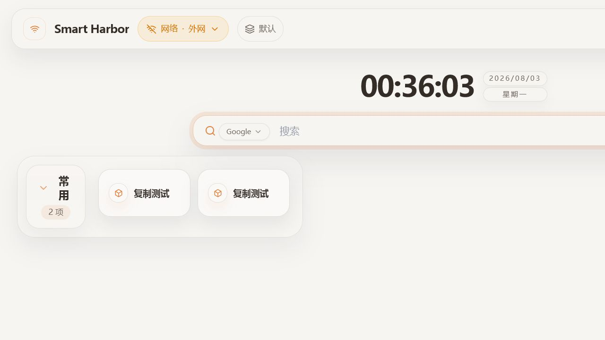
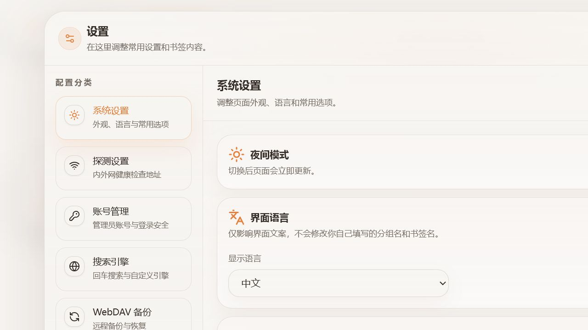
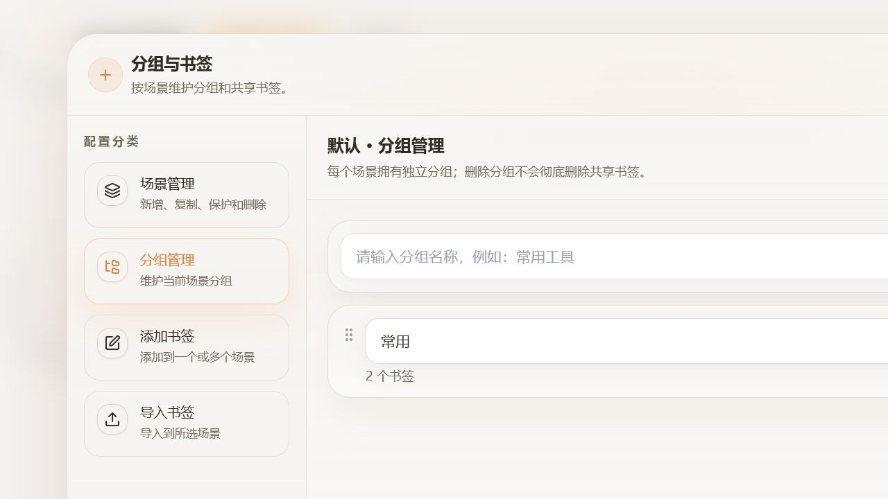

# Smart Harbor

[English](README.md)

Smart Harbor 是一个面向个人自托管服务的智能导航主页。

它能够自动检测当前的网络环境，并在局域网地址和公网地址之间智能切换，始终选择最合适的访问入口。

## 界面预览

### 首页



### 设置面板



### 书签管理



### Chrome 新标签页插件


## 适合用来做什么

- 按网络环境自动切换书签的局域网和公网地址
- 支持动态创建导航场景，每个场景拥有独立分组和排序
- 同一个书签可放入多个场景，并在各场景使用不同分组
- 场景可单独设置密码，解锁状态仅在当前浏览器会话内保留
- 拖拽整理分组书签，并支持图标展示
- 内置搜索框，支持自定义搜索引擎
- WebDAV 备份、恢复和版本保留
- 受密码保护的管理面板和登录锁定保护
- 可选的 Chrome 新标签页插件

## 快速部署

### Docker Compose

```yaml
services:
  smart-harbor:
    build:
      context: .
      dockerfile: Dockerfile
    image: smart-harbor:local
    container_name: smart-harbor
    restart: always
    ports:
      - "8080:80"
    environment:
      NODE_ENV: production
      PORT: "80"
      CONFIG_DIR: /app/config
      TZ: Asia/Shanghai
    volumes:
      - /volume1/docker/smart-harbor/config:/app/config
    security_opt:
      - no-new-privileges:true
```

仓库根目录已经包含适用于群晖 Container Manager 的 `docker-compose.yml`。把仓库（包括 `Dockerfile`）放入项目目录，按实际情况修改左侧的群晖配置目录，然后选择“构建并启动”。宿主机目录可以改成你自己的共享文件夹路径；容器内路径 `/app/config` 不要修改。

### Docker Run

```bash
docker run -d \
  --name smart-harbor \
  -p 8080:80 \
  -v ./smart-harbor/config:/app/config \
  smart-harbor:local
```

启动后：

1. 打开 `http://localhost:8080`。
2. 首次访问时创建管理员账号。
3. 在书签管理中创建场景和分组，然后添加或导入书签。

## 配置文件说明

首次启动后，Smart Harbor 会在挂载的配置目录中生成一个统一的 `config.json`。

- 宿主机示例路径：`./smart-harbor/config/config.json`
- 容器内路径：`/app/config/config.json`

### 常用字段

| 路径 | 作用 |
| --- | --- |
| `system.appName` | 页面标题和浏览器标签名称 |
| `system.darkMode` | 明暗主题切换 |
| `system.clickOpenTarget` | 单击打开书签和搜索结果的方式 |
| `system.middleClickOpenTarget` | 中键打开书签和搜索结果的方式 |
| `system.defaultSearchEngine` | 搜索框默认搜索引擎 |
| `system.webdavBackup` | WebDAV 备份地址、周期和保留策略 |
| `navigation.defaultSceneId` | 没有设备偏好时使用的默认场景 |
| `navigation.scenes[]` | 可动态维护的场景及其独立分组 |
| `navigation.bookmarks[]` | 由各场景分组引用的共享书签定义 |

<details>
<summary>完整配置字段</summary>

#### `system`

| 路径 | 说明 | 备注 |
| --- | --- | --- |
| `system.appName` | 应用名称，显示在页面和浏览器标签中 | 默认 `Smart Harbor` |
| `system.darkMode` | 是否启用深色模式 | `true` 或 `false` |
| `system.clickOpenTarget` | 单击打开方式 | `self` 或 `blank` |
| `system.middleClickOpenTarget` | 中键打开方式 | `self` 或 `blank` |
| `system.defaultSearchEngine` | 默认搜索引擎标识 | 必须指向内置或自定义引擎 |
| `system.customSearchEngines[]` | 自定义搜索引擎列表 | 可选 |
| `system.customSearchEngines[].id` | 自定义搜索引擎唯一标识 | 仅允许小写字母、数字和短横线 |
| `system.customSearchEngines[].name` | 自定义搜索引擎显示名称 | 非空字符串 |
| `system.customSearchEngines[].urlTemplate` | 搜索地址模板 | 必须包含 `{keyword}` |
| `system.webdavBackup.url` | WebDAV 服务地址 | 留空表示不启用 |
| `system.webdavBackup.username` | WebDAV 用户名 | 配置备份时必填 |
| `system.webdavBackup.password` | WebDAV 密码或应用专用密码 | 配置备份时必填 |
| `system.webdavBackup.remotePath` | 远端备份目录 | 默认 `/smart-harbor` |
| `system.webdavBackup.autoBackup` | 是否开启自动备份 | `true` 或 `false` |
| `system.webdavBackup.intervalDays` | 自动备份间隔天数 | `1` 到 `365` 的整数 |
| `system.webdavBackup.maxVersions` | 保留的远端备份版本数 | `1` 到 `365` 的整数 |
| `system.auth.username` | 管理员用户名 | 首次设置后写入 |
| `system.auth.passwordHash` | 管理员密码哈希 | 不要保存明文密码 |

#### `navigation`

| 路径 | 说明 | 备注 |
| --- | --- | --- |
| `navigation.defaultSceneId` | 默认场景标识 | 必须引用一个已有场景 |
| `navigation.scenes[]` | 有序场景列表 | 至少保留一个场景 |
| `navigation.scenes[].id` | 场景唯一标识 | 仅允许小写字母、数字和短横线 |
| `navigation.scenes[].name` | 场景显示名称 | 非空字符串 |
| `navigation.scenes[].protected` | 是否需要额外的场景密码 | 布尔值 |
| `navigation.scenes[].passwordHash` | 服务端维护的场景密码哈希 | 不要写入明文密码 |
| `navigation.scenes[].groups[]` | 当前场景拥有的分组 | 有序数组 |
| `navigation.scenes[].groups[].bookmarkIds[]` | 分组中展示的书签标识 | 引用 `navigation.bookmarks[].slug` |
| `navigation.bookmarks[]` | 全局共享的书签定义 | 同一书签可被多个场景引用 |
| `navigation.bookmarks[].slug` | 书签唯一标识 | 仅允许小写字母、数字和短横线 |
| `navigation.bookmarks[].name` | 书签显示名称 | 非空字符串 |
| `navigation.bookmarks[].icon` | Lucide 图标名称 | 可选 |
| `navigation.bookmarks[].primaryUrl` | 主地址，通常填局域网地址 | 必填 URL |
| `navigation.bookmarks[].secondaryUrl` | 切换地址，通常填外网地址 | 可选 URL |
| `navigation.bookmarks[].probes[]` | 用于探测当前网络可达性的地址列表 | 可选，至少一个 URL |
| `navigation.bookmarks[].forceNewTab` | 是否强制在新标签页打开该书签 | 可选布尔值 |

</details>

<details>
<summary><code>config.json</code> 示例</summary>

```json
{
  "system": {
    "appName": "Smart Harbor",
    "darkMode": false,
    "clickOpenTarget": "self",
    "middleClickOpenTarget": "blank",
    "defaultSearchEngine": "google",
    "customSearchEngines": [
      {
        "id": "my-search",
        "name": "自定义搜索",
        "urlTemplate": "https://example.com/search?q={keyword}"
      }
    ],
    "webdavBackup": {
      "url": "https://dav.example.com/remote.php/dav/files/demo",
      "username": "demo",
      "password": "app-password",
      "remotePath": "/smart-harbor",
      "autoBackup": true,
      "intervalDays": 7,
      "maxVersions": 10
    },
    "auth": {
      "username": "admin",
      "passwordHash": "<generated-after-setup>"
    }
  },
  "navigation": {
    "defaultSceneId": "personal",
    "bookmarks": [
      {
        "slug": "proxmox",
        "name": "Proxmox",
        "icon": "Server",
        "primaryUrl": "http://192.168.1.10:8006",
        "secondaryUrl": "https://proxmox.example.com",
        "probes": ["http://192.168.1.1"],
        "forceNewTab": true
      }
    ],
    "scenes": [
      {
        "id": "personal",
        "name": "个人",
        "protected": false,
        "groups": [
          {
            "id": "infrastructure",
            "name": "基础设施",
            "bookmarkIds": ["proxmox"]
          }
        ]
      }
    ]
  }
}
```

</details>

## 账号与安全

- 首次访问会引导你创建管理员账号。
- 项目只保留一个管理员账号，不提供游客模式。
- 受保护场景需要单独解锁：浏览器使用会话存储保存令牌，服务端令牌最长有效一小时。
- 普通书签或分组编辑不会结束场景解锁；关闭浏览器/标签页、修改场景密码、恢复备份或重启服务后需要重新输入。
- 如果需要重置登录信息，删除 `config.json` 中的 `system.auth` 段后刷新页面即可。
- 连续登录失败 5 次后，会锁定 30 分钟。

## 场景与导入规则

- 后台支持新增、重命名、复制、排序、设为默认和删除场景。
- 每个场景独立维护分组及顺序；书签定义全局共享，因此同一书签可以加入多个场景，并分别选择不同分组。
- 新增书签时可一次选择多个“场景 + 分组”发布位置。
- 浏览器书签导入时先选择一个目标场景。多层文件夹会按完整路径扁平化为一级分组，例如 `书签栏 / 开发 / 前端`；根目录书签进入“导入书签”分组。

## Chrome 新标签页插件

如果你希望每次打开 Chrome 新标签页都直接进入 Smart Harbor，可以直接安装 Chrome 插件。

- `primaryUrl`：主地址，通常填写局域网地址
- `fallbackUrl`：切换地址，通常填写外网地址
- `openMode`：`embedded` 表示在新标签页中以内嵌方式打开，`direct` 表示直接跳转
- `probeTimeoutMs`：地址探测超时时间，默认 `200`
- 点击浏览器工具栏中的插件图标即可打开设置页

### 安装方式

从 [Chrome 网上应用店](https://chromewebstore.google.com/detail/smart-harbor/jbghdmdpfmnkincfamcbolbcnlogedad) 安装 Smart Harbor，然后点击浏览器工具栏中的插件图标，填写你的 Smart Harbor 访问地址。

### 本地构建

如果需要开发调试或私有测试，也可以在本地构建插件：

```bash
npm run build:extension
npm run package:extension
```

生成结果：

- 目录：`extension/smart-harbor-v<version>`
- 压缩包：`extension/smart-harbor-v<version>.zip`

## 已知问题

- 在 iOS 设备上，如果 Smart Harbor 是通过 HTTPS 打开的，浏览器通常无法从该页面直接探测 HTTP 局域网地址。这会导致自动网络探测无法准确判断当前应使用内网还是外网地址。
- 为了兼容这种限制，首页左上角的网络状态弹窗提供了 `自动检测`、`局域网`、`外网` 三个直选项。遇到 iOS 无法探测的情况时，可以手动切换到当前需要的网络模式。

## 本地开发

```bash
npm install
npm run dev
```

- 前端：`http://localhost:3000`
- 后端 API：`http://localhost:3001`

常用命令：

```bash
npm run lint
npm run test
npm run build
npm run preview
```

## 技术栈

React 19、TypeScript、Vite、Tailwind CSS、Zustand、TanStack Query、Fastify、Zod。

## 感谢支持

感谢 OpenAI Codex 和 Claude 在实现、迭代与文档整理过程中提供的支持。

## 许可证

[Apache-2.0](LICENSE)
